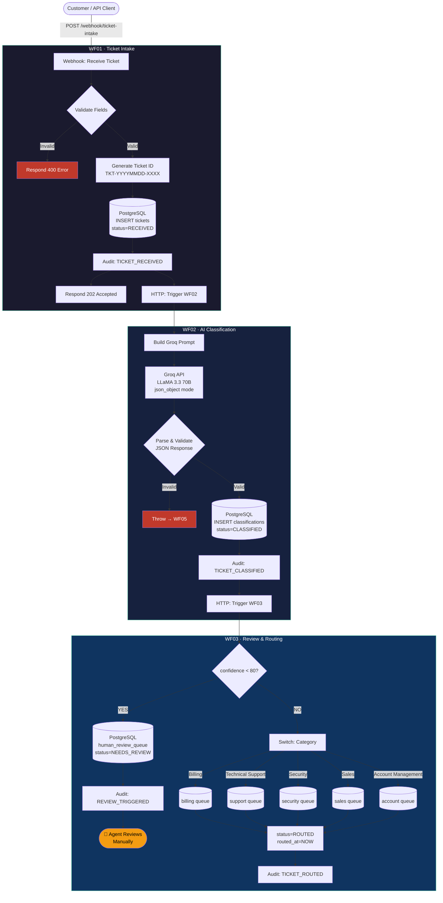
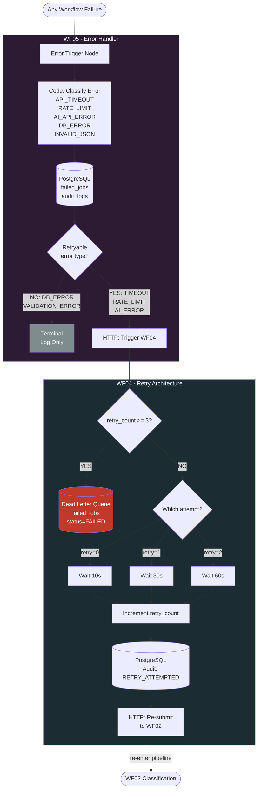
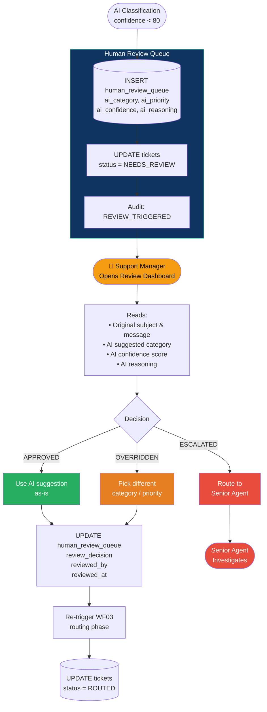
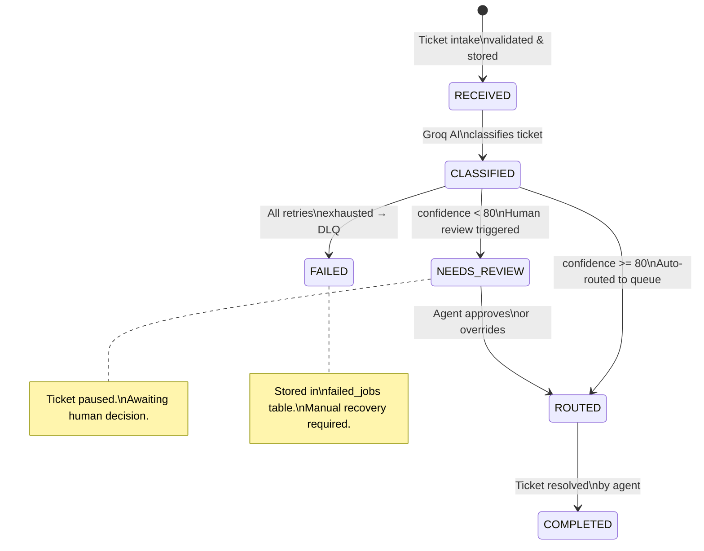
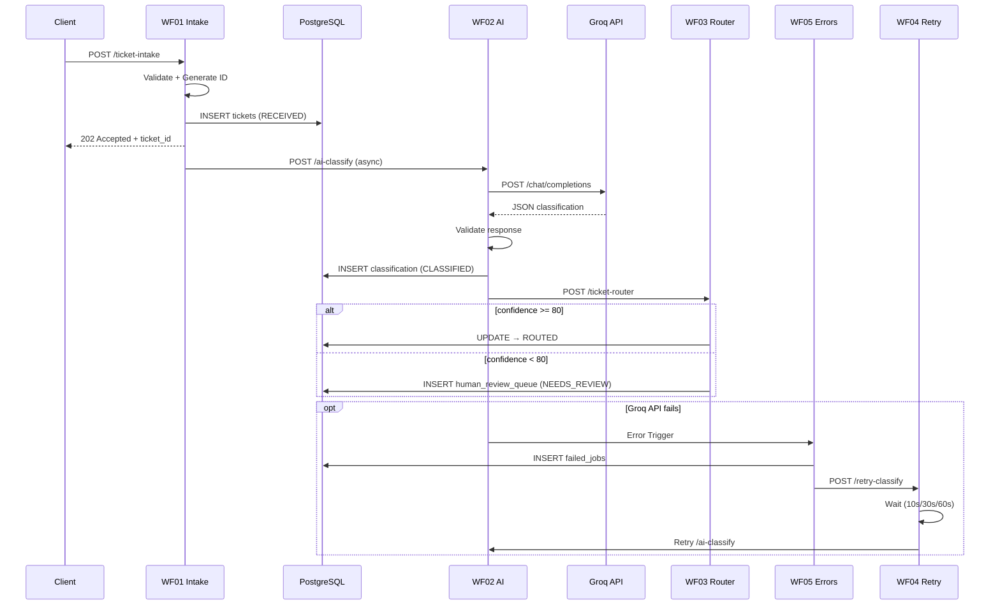

# System Diagrams

All diagrams use Mermaid syntax. Render at https://mermaid.live or in any Markdown viewer.

---

## 1. Main System Flow

---

## 2. Error & Retry Flow

---

## 3. Human Review Flow

---

## 4. Database State Machine

---

## 5. Workflow Chain Overview

